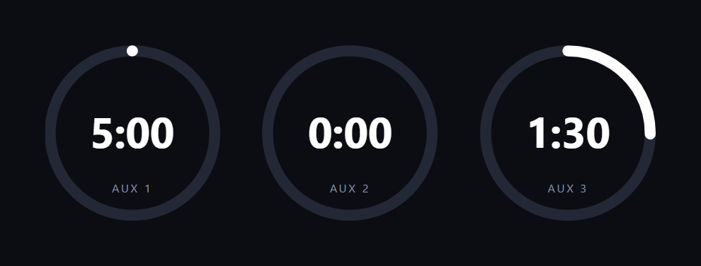
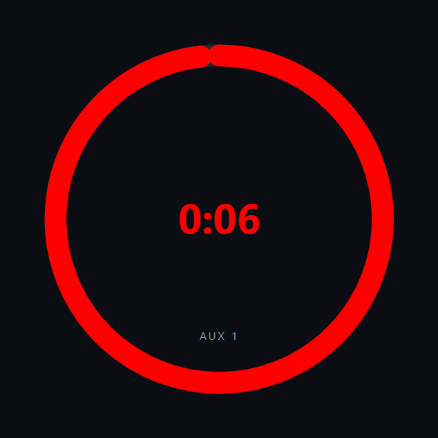
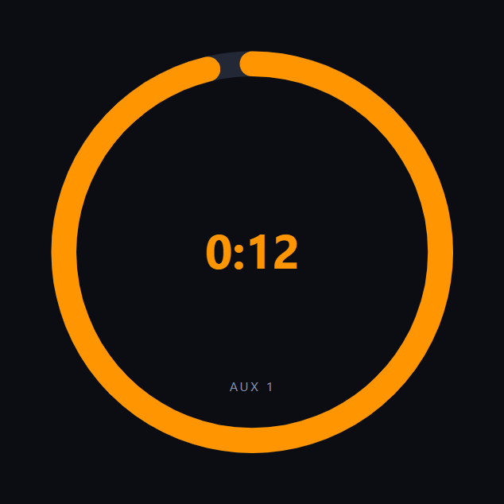
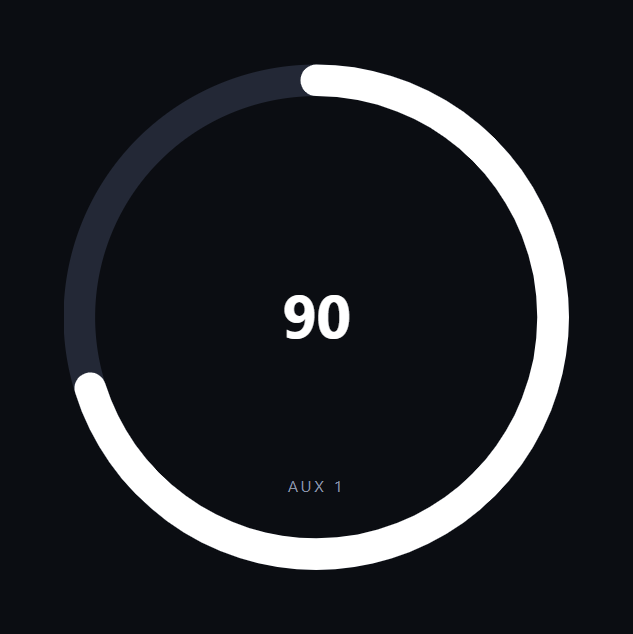
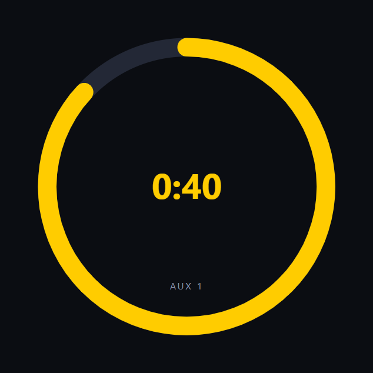
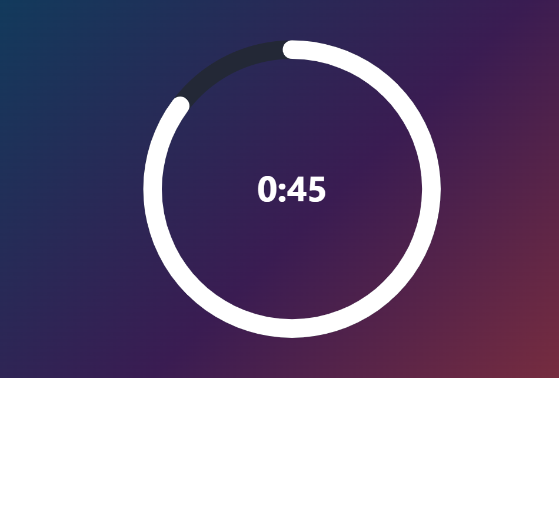
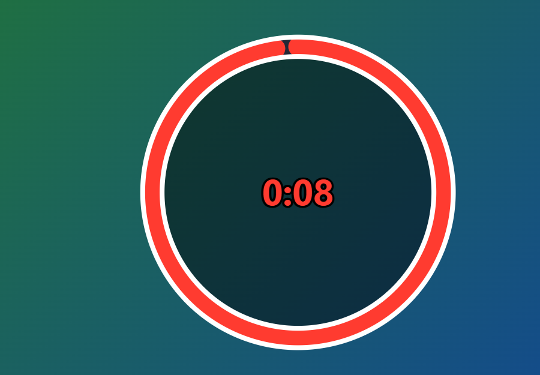

# Ontime Aux Timers — Custom View

A custom [Ontime](https://getontime.no) view that displays the three auxiliary
timers (**Aux 1**, **Aux 2**, **Aux 3**) as large circular gauges. The time is
shown in the centre of each circle, and the ring fills **clockwise** as the
timer progresses — for both count-up and count-down timers.

The view connects to Ontime's WebSocket runtime stream and updates live.

- Custom views: https://docs.getontime.no/features/custom-views/
- Runtime data: https://docs.getontime.no/api/data/runtime-data/



## Files

| File         | Purpose                                            |
| ------------ | -------------------------------------------------- |
| `index.html` | Page markup and the SVG ring template              |
| `styles.css` | Layout and ring styling                            |
| `app.js`     | WebSocket connection, data handling and rendering  |

## How the ring fills

The progress ring only applies to **count-down** timers, where it fills
clockwise as the timer elapses towards zero: `(duration - current) / duration`.

For **count-up** timers the ring is redundant, so it is hidden and only the
white digits are shown.

By default the ring and digits are **white**. When a count-down gets close to
zero (see the `warn` option) they switch to the warning colour (red by default).

## Display options

All options are set via URL query params and can be combined. They also work
together with `aux`, `server` and `token`.

| Option         | Example              | Effect                                                            |
| -------------- | -------------------- | ----------------------------------------------------------------- |
| `transparent`  | `?transparent`       | Transparent background for compositing in vMix / OBS              |
| `color`        | `?color=white`       | Main colour of the ring and digits (default white). Any CSS colour |
| `warn`         | `?warn=10`           | Seconds left on a count-down before switching to the warning colour |
| `warncolor`    | `?warncolor=red`     | Colour used for the warning (default red). Any CSS colour          |
| `notice`       | `?notice=15`         | Seconds left before an intermediate notice colour (before warning)  |
| `noticecolor`  | `?noticecolor=orange`| Colour used for the notice state (default orange). Any CSS colour   |
| `flash`        | `?flash`             | Flash the digits once per second during the warning period          |
| `stopatzero`   | `?stopatzero`        | Stop a count-down at 0 instead of showing negative time             |
| `offset`       | `?offset=1`          | Seconds early the ring reaches full (default 1) so it completes at 0:00 |
| `fontsize`     | `?fontsize=6rem`     | Size of the timer digits. Bare numbers are treated as px            |
| `stroke`       | `?stroke=20`         | Ring stroke width (SVG units, viewBox is 200×200; default 12)        |
| `fill`         | `?fill=%2300000080`  | Fill the circle behind the digits. Accepts alpha (e.g. `#00000080`)  |
| `ringoutline`  | `?ringoutline=white` | Outline along the inner + outer edges of the ring. Any CSS colour    |
| `ringoutlinewidth` | `?ringoutlinewidth=3` | Ring outline thickness (SVG units; default 2)                  |
| `fontoutline`  | `?fontoutline=black` | Outline around the digits. Any CSS colour (accepts alpha)            |
| `fontoutlinewidth` | `?fontoutlinewidth=4` | Font outline thickness. Bare numbers are px (default 2)         |
| `labels`       | `?labels=off`        | Show or hide the timer name (default on). off/false/0/hide to hide   |
| `seconds`      | `?seconds`           | Show a plain seconds count (`90`) instead of `M:SS` (`1:30`)       |
| `lastminute`   | `?lastminute`        | Switch to seconds-only (`45`) in the final minute of a count-down   |

Examples:

```
?transparent&aux=1                     # single timer, transparent overlay
?warn=10&warncolor=red                 # go red in the last 10 seconds
?notice=15&warn=10                     # orange at 15s, then red at 10s
?seconds                               # 90 instead of 1:30
?color=%23ffcc00&warn=15               # amber digits, warn at 15s (# = %23)
?transparent&fill=%2300000080&ringoutline=white&fontoutline=black   # overlay chip
```

> Note: a raw `#` in a URL starts the *fragment*, so hex colours need care.
> Either **drop the `#`** (e.g. `fill=ECC04080`) or URL-encode it as `%23`
> (e.g. `fill=%23ECC04080`) — both work. You can also use a named colour like
> `white`, `red`, `yellow`. Colours for `fill`, `fontoutline` and the others
> accept transparency — use an 8-digit hex (`RRGGBBAA`, e.g. `00000080` for 50%
> black) or an `rgba(...)` value.

### What the options look like

<table>
  <tr>
    <td align="center">
      <code>?warn=10&amp;warncolor=red</code><br>
      
    </td>
    <td align="center">
      <code>?notice=15&amp;warn=10</code><br>
      
    </td>
  </tr>
  <tr>
    <td align="center">
      <code>?seconds</code><br>
      
    </td>
    <td align="center">
      <code>?color=%23ffcc00&amp;warn=15</code><br>
      
    </td>
  </tr>
  <tr>
    <td align="center">
      <code>?transparent</code> (shown over a stage backdrop)<br>
      
    </td>
    <td align="center">
      Production preset<br>
      
    </td>
  </tr>
  <tr>
    <td align="center" colspan="2">
      <code>?transparent&amp;fill=%2300000080&amp;ringoutline=white&amp;fontoutline=black</code><br>
      
    </td>
  </tr>
</table>

The production preset above is:

```
?warn=10&aux=1&labels=off&fontsize=120&flash&stopatzero&lastminute&notice=15
```

## Deploying to Ontime

Ontime serves any folder placed inside its `external/` directory. Copy this
folder (containing `index.html`, `styles.css`, `app.js`) into Ontime's
`external/` folder, e.g. `external/aux-timers/`, then open:

```
http://<ontime-ip>:<port>/external/aux-timers/
```

When served this way the view automatically connects to the same host over
`/ws`, so no configuration is needed.

## Showing only some timers

By default all three timers are shown. Use the `aux` query param to pick which
ones to display — no need for separate folders:

```
index.html?aux=1        # only Aux 1
index.html?aux=2        # only Aux 2
index.html?aux=1,3      # Aux 1 and Aux 3
```

The selected timers fill the available space, so a single timer is shown large
and centred. This works together with the other params, e.g.
`?aux=1&server=192.168.1.10:4001`.

## Preview locally

**Demo mode** (no Ontime server required) simulates the three timers:

```
http://localhost:8000/index.html?demo=1
```

Serve the folder with any static server, for example:

```bash
python3 -m http.server 8000
```

Then open http://localhost:8000/?demo=1

In demo mode you can also preset a timer's value and freeze it (handy for
screenshots): `?d1=8` / `?d2=45` / `?d3=12` set each timer's current value in
seconds, and `?freeze` holds them still. For example
`?demo&aux=1&warn=10&d1=8&freeze`.

## Connecting to a remote Ontime server

If you host the view somewhere other than Ontime itself, pass the server
address (and a token if the stage is password protected) as query params:

```
index.html?server=192.168.1.10:4001
index.html?server=192.168.1.10:4001&token=YOUR_TOKEN
```

Get the token from Ontime via *Editor → Settings → Share link* with
"Authenticate Link" enabled.
